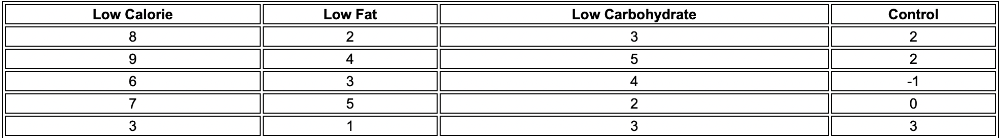

As mentioned in the previous blog,  I will be mainly discussing about **ANOVA** and **Regression analysis** in this post. Whatever statistical tests that we have discussed they try to establish relationship between means of only two groups.   What if we have more than two groups or more than two independent variables.

Let's assume a hypothetical scenario of you being a doctor and conducting a research on effectiveness of a drug on a given population. You come to conclusion that this drug is effective against a disease. But how would you convince the higher authority about your decision. You will need some confidence to quantify the effectiveness and the evidence. How would you know that the given medicine was effective given a situation where a group was already on some other medication or was already  cured prior to testing.

ANOVA can be a solution to such situations. It is a kind of staisctical test that helps you quantify the confidence of such scenarios. before proceeding  further, you need to know about some useful terminologies. Let's see them.

**A/B testing:** It is an experiment to test which procedure, treatment or decision was effective/superior. Often one of the two treatment is existing treatment or no treatment. If a standard( or no) treatment is used for some groups,  they are known as *control* *groups*. A standard hypothetical test is better than those of  control groups. In this testing, a test subject is exposed to treatment in random manner e.i subjects are chosen randomly. In this way you know that any differnce between the treatments on these subjects are due to two things.

1. The effect of different treatments.
2. Luck of the draw in which subjects are assigned to treatments.

To quantify the behaviour of treatments, you need to decide a single metric for all the subjects before hand , otherwise it opens a lots of scope for biases. A/B testing are typically constructed keeping **Hypothesis tests** in mind. Hypothesis test was invented to safeguard researchers from  being fooled by a random chance. A Hypothesis test is further assessment of A/B test, or any randomised event, to asses whether random chance is a reasonable explanation for the observed difference between groups A and B.

**Between group variability:**  ANOVA is the ratio of between group variabilty to within group variability. It provides the global assesment of statistical test between more two or more tha. two means. It tells about how the means of different groups are related. Let's see how can define all these terms with an example.

Consider following problem statement.

*A clinical trial is run to see the outcome of a weight loss program. Participants are randomly selected. independent variable of interest is only weight loss and participants are randomly divided into groups of five.  Control group is selected to measure the placebo effect( weight loss is significant just because of participating only). Details are mentioned in the table below.*

  
  <figcaption  align="center" style='font-style:italic; color:black;'>source: References[1] </figcaption>

Let $\mu1,$ $\mu2,$ $\mu3,$ and  $\mu4$ be the means of groups *Low calories*, *Low fat, Low carbohydrate* and *Control*  respectively.  Then the **Grand mean** $\mu$ is given by .
$$
\mu  = \frac{\mu1 + \mu2 + \mu3 + \mu4}4
$$

**Between group variability (SSB)** is given by
$$
SSB = \frac{∑_i(\mu_i-\mu)^2}{df} \
$$
Where ***df*** is the degree of freedom is given by
$$
df = k-1
$$
where ***K*** is the total number of group participating in this experiment (for the given table, k = 4).

Intutively we can say that if the overlappig between groups is more, lesser is the *grand mean* and vice-versa. 

**Within group variability:** 

## References

1. https://sphweb.bumc.bu.edu/otlt/mph-modules/bs/bs704_hypothesistesting-anova/bs704_hypothesistesting-anova_print.html

2. 

