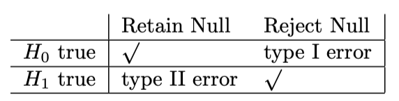
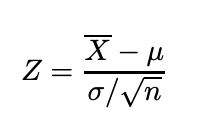

_Science has never been defined by infallibility or superhuman perfection. It has always been about healthy skepticism, about putting every hypothesis to the test_. \
 _- Ben Orlin, Math with Bad Drawings_

---

Hypothesis testing is like legal trial. In law, you assume someone is innocent until proven guilty with enough evidence. Similarly, in statistics, you assume that your null hypothesis is true until you have enough evidence to reject it. In this blog post, I will talk about Hypothesis testing in general. I will mostly cover the type of hypothesis and how to approach a decision making problem with respect to hypothesis testing.

Hypothesis testing plays an important role in statistics for decision making. The outcome of any study solely depends upon the evidences that you gather from the experiments. Usually, hypothesis testing is performed over a sample of a population. Suppose, you want to know if the online study is more effective on the students or the offline study. To make a decision, you take some students who studied online over a period of time and another group of students who studied offline for the same period of time. There are two types of hypothesis, **Null hypothesis** and **Alternative hypothesis.** For the above case, your null hypothesis would be “ Both offline and online mode are equally effective” and Alternate hypothesis would be “effect is not the same for both online and offline mode”. If the offline mode is more effective than online mode, you will reject the null hypothesis and conclude that evidence favours the alternative hypothesis. The above case is an example of **two-tailed** hypothesis testing. I will discuss more about **two-tailed** hypothesis testing in this post later. Note that it’s not the only way of assuming the hypothesis. Your **null** and **alternative** hypothesis may be different for the similar kind of problem depending upon your experiment and use cases. Let’s talk in the language of statistics.

Let X be a random variable and 𝒳 be the range of random variable X. We test a hypothesis by finding a subset of random variable X∈R where R is the rejection region. As stated earlier, null hypothesis is denoted by H0 and alternative hypothesis is denoted by H1. So, if x∈R, we reject H0 and accept H1, otherwise we do not reject H0.

<p align="center">
  
</p>

There are two types of errors one can possibly make during hypothesis testing. Rejecting H0 when H0 is true can causes **Type I** error and retaining H0 when H1 is true can cause **Type II** error.

<p align="center">
  
</p>

Before exploring the technical aspects of hypothesis testing, You need to have knowledge about following terminologies.

**Significance level(𝝰):** It is the probability of rejecting a null hypothesis when null hypothesis is true. In laymen term, It is the amount of risk, that we are willing to take for committing **type I** error . The most commonly value used is 0.05, means if you calculate the range of mean value for a population or sample, then 5 out of 100 times, mean does not lie in the region even if it is said to be. It signifies the rejection region. Any value that falls inside this region, is rejected. The value of alpha depends upon the types of experiments that you are studying. If you are trying to prove the effectiveness of a drug, then you might want to decrease the risk by limiting the alpha value to 1% because you wouldn’t want any potential risk to patients.


**Note**: In case of two-tailed test, rejection region of both tails add upto alpha value of 0.05, each with 0.025.

**P value(p):** It is the output value of your hypothesis test. In simple term, it is the probability of observing that sample when your null hypothesis is true. Therefore if p-value is less than than the significance level, then we reject the null hypothesis or accept otherwise.

### Steps involved in hypothesis testing:

1. Formulate hypothesis
2. Decide statistical test
3. find the test statistics
4. make decision based on test output.

### Tests used in hypothesis testing

The most crucial part of the hypothesis testing is to choose appropriate hypothesis test. Most commonly used tests are [**Z-test**](https://en.wikipedia.org/wiki/Z-test)**,** [**t-test,**](https://en.wikipedia.org/wiki/Student's_t-test) [**chi-square test**](https://en.wikipedia.org/wiki/Chi-squared_test)**,** [**ANOVA**](https://en.wikipedia.org/wiki/Analysis_of_variance) etc. Let’ see them in brief one-by-one.

<div style="text-align: center;"> <u><h4>Z-Test </h4></u></div>

**Z-test**: It is a statistical test which is used to state the relation between two population mean and sample mean or two sample means whether they are different or similar when the population mean and standard deviation are known. If you would like to perform two-tailed test, then your null hypothesis(**H0**) would be “ Means of both the population are same(**μ1** = **μ2**)” and alternate hypothesis would be “ both the population means are different”. Generally we assume our null hypothesis to be true until we find a strong evidence against it. Let me illustrate it with an example in python.

##### Two-tailed test from a normal distribution:

- A professional  basketball  team wants to compare its performance with  that of players  in a regional league.

- The pros are known to have a historic mean of 12 points  per game with  a standard  deviation  of 5.5. 

- A group  of 36 regional players recorded on average 10.7 points  per game.

- The pro coach would like to know whether  his professional  team scores on average are different from that of the regional players.

  So far, we have population mean (𝜇) , population standard deviation(𝜎). 

  __State the null hypothesis__

  - **$H_0$: $x = µ_1$** ("The mean point of the regional players is not different from the historic mean")

  - **$H_1$: $x ≠ µ_1$** "The mean point of the regional players is different from the historic mean")

    

    When the population standard deviation is given and we are asked to deal with a sub-sample, the size (n) of the sub-sample is used in the formula:
  
    <p align="center">
      
    </p>
  
    
  
    ```python
    #find the cdf for the z value and then multiply by 2
    # we multiply by 2, because its a two tailed hypothesis
    #this gives overall p value
    #if pvalue < significance level, we neglect the null hypothesis
    
    pval = 2*round(scipy.stats.norm.cdf((10.7 - 12)/(5.5/sqrt(36))), 3)
    ```
  
    pvalue comes out to be `0.156`. Since it is greater than `0.05`(significance level), we acept the null hypothesis. We can say with 95% confidence that mean value of regional player is not different from the historic mean.
  
    

<div style="text-align: center;"> <u><h4>T-Test </h4></u></div>

 **t-test:**  It is a kind of inferential statistical hypothesis test which is used to differentiate between the means of two groups. Under null hypothesis, samples follow [*student-t*](https://en.wikipedia.org/wiki/Student's_t-test) distribution. it is similar to z-test but differs in the case of known parameters. *z test* is used when population mean and standard deviation are know while if the population standard deviation is not known, we use *t-test*. Certain assumptions are made about samples before applying t-test. Data should be normally distributed. All the data should follow equal scale of measurement. Variance of samples should be homogenous. You can use [*Levene test* ](https://www.google.com/url?sa=t&rct=j&q=&esrc=s&source=web&cd=&cad=rja&uact=8&ved=2ahUKEwiGy-Hqwc7yAhXTzTgGHUWrDrYQFnoECAIQAQ&url=https%3A%2F%2Fdocs.scipy.org%2Fdoc%2Fscipy-0.14.0%2Freference%2Fgenerated%2Fscipy.stats.levene.html&usg=AOvVaw3FNtE4d2_pzpre7zQPOKTL)or [*barlette test*](https://www.google.com/url?sa=t&rct=j&q=&esrc=s&source=web&cd=&cad=rja&uact=8&ved=2ahUKEwjzxueDws7yAhULzTgGHT4yDQYQFnoECAoQAw&url=https%3A%2F%2Fdocs.scipy.org%2Fdoc%2Fscipy%2Freference%2Fgenerated%2Fscipy.stats.bartlett.html&usg=AOvVaw3odjCXDsPo0j7B2BmoUrK6)*.* These tests are included with [*scipy*](https://docs.scipy.org/doc/scipy/getting_started.html) library. If sample variances are not equal, then you can perform [*welch’s t-test*](https://www.google.com/url?sa=t&rct=j&q=&esrc=s&source=web&cd=&cad=rja&uact=8&ved=2ahUKEwjNgYvcws7yAhXFzjgGHcHkBvkQFnoECBUQAQ&url=https%3A%2F%2Fen.wikipedia.org%2Fwiki%2FWelch%27s_t-test&usg=AOvVaw0F460YiD8scYjBmE4l312B)  instead. Let's see t-test with an example in python.

We will be using the t-test for independent samples. For the independent t-test, the following assumptions must be met.

- One independent, categorical variable with two levels or group

- One dependent continuous variable

- Independence of the observations. Each subject should belong to only one group. There is no relationship between the observations in each group.

- The dependent variable must follow a normal distribution

- Assumption of homogeneity of variance

  

##### Test the hypothesis that sleeping for at least 8 hours makes one smarter, 12 people who have slept for at least 8 hours every day  for the past one year  have their IQ tested.(one sample t-test)

- Here are the results: 116, 111, 101, 120, 99, 94, 106, 115, 107, 101, 110, 92

- Test using the following hypotheses: H0: μ = 100 or Ha: μ > 100 

  ```python
  ## insert code here
  obs = np.asarray([116, 111, 101, 120, 99, 94, 106, 115, 107, 101, 110, 92])
  sample_mean = obs.mean()
  sample_std = obs.std()
  t = (sample_mean - 100)/(sample_std/np.sqrt(len(obs)))
  pval = scipy.stats.norm.cdf(t)
  if pval < 0.05:
      print("mean > 100")
  else:
      print("mean = 100")
  print(pval)
  ```

  Output:

  ```tex
  mean = 100
  0.9930151090393933
  ```

Since the `pval > 0.05`, we accept the null hypothesis that mean value is still the same and sleeping for 8 hours does not make people smarter.


<div style="text-align: center;"> <u><h4>Chi-square Test </h4></u></div>

**Chi-square test**:  There are two types of chi-square test. Once is `chi-square test of independence`  and another is `chi-sqaure test of goodness of fit`.  in case of [goodness of fit](https://www.statisticshowto.com/goodness-of-fit-test/), a sample is compared against a population parameter, whether they blong to the given population or not.   We will explore `chi-square test of independence` a little here.

for independence test, two variables are compared in a contingency table to compare whether they are independent of each other or not. If yes, then  what is the extent of relationship among them. Chi-square statistics is given by:
$$
\tilde{\chi_c}^2=\frac{1}{d}\sum_{k=1}^{n} \frac{(O_k - E_k)^2}{E_k}\
$$


The subscript ***c***  is the degreee of freedom.  **O**  is your observed value and  **E** is your expected value.  Let's see it with  a toy example in python.

#### Chi-square test to establish the fact that does gender affects a person status of being single.

​	__State the null hypothesis__

- **$H_0$:** Gender does not have any effect on a person status of being single.

- **$H_1$**: Relation exist between gender and is_single.

  ```tex
  is_single = ['yes', 'no', 'no' , 'no', 'no' ,'no' ,'no' ,'no' ,'no' ,'no' ,'no' ,'no' ,'yes','yes','yes','yes','yes','yes','yes','yes', ]
  
  Gender = ['male', 'female', 'male', 'female', 'female',, 'female', 'female', 'female','male', 'male', 'male', 'male','male','male','male','male','female', 'male',, 'female', 'male']
  ```

  create a contingency table.

  ```python
  #use pd.crosstab to create contingency table
  cont_table  = pd.crosstab(is_single, Gender)
  cont_table
  ```

  Output:

  <p align="center">
    
  </p>	

  ```python
  stat, pval, _, _ = scipy.stats.chi2_contingency(cont_table, correction = True)
  pval
  ```

  output:

  ```tex
  0.3128706786297984
  ```

Since the `pval > 0.05`, accept the null hypothesis saying that a person status of being single does not depend upon his gender.


That's all for this post. We will explore about **ANOVA** in next blog.  We will also see that we can also use **regression analysis** to perform all these tests. So, stay tuned.. .

Happy learning!