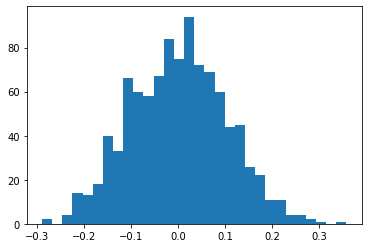
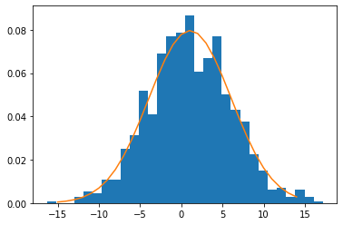
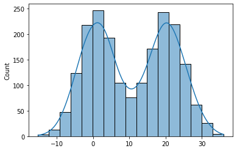

## Introduction
---
In statistics and Machine Learning, we often get to work with data samples. These samples are used to estimate the 
behaviour of the population. In inferential statistics, density estimation is used to derive informations about the population. Probability density estimation is an unsupervised method that lies along the line of feature engineering and data modeling. In this post, we will see the basics of density estimation method and how we can laverage the existing libraries to serve these purposes.
There are mainy two types of density estimation methods namely, `Parametric` and `Non-parametric`. We will see each of them one by one.


## Table of contents:
1. [Histogram based density summarization](#histogram-based-density-summarization)
2. [Parametric method for density estimation](#paramteric-method)
3. [Mixture Model](#mixture-model)
3. [Non-parametric method for density estimation](#non-parametric-method)


<!-- <a id='histogram_density_summarization'></a> -->
### Histogram based density summarization
---
Histotgram is itself a non-parametric method but it is also one of the easiest method to visualise the shape of the distribution in no time. One of the major drawback of this approach is that it's shape is highly affected by the parameter `bin` size. Here is the quick guide to solve any density estimation problem. 
- Use histogram to plot the samples.
- Shape of histogram can give you the best estimate of the probability distribution like Normal distribution, uniform distribution, exponential distribution etc.
- Once you have the idea of shape, you can proceed with the parametric or non-parametric method for density estimation based on the shape.
  - For unimodal histogram, Parametric method is the suitable choice.
  - For bimodal or multimodal distribution, Non-parametric method is the go to choice but not necessary.


```python
# generate m random samples
samples = np.random.normal(0, 0.1, size=1000)

plt.hist(samples, bins=30)
plt.show()
```


    

    


Above histogram plot matches the well known bell curve. This is obvious because we have sampled from Normal distribution.

### Paramteric Method
---
Once you have the histogram plot, it's shape matches some of the well known probability distributions such as Normal, uniform etc. After knowing the distribution, you can estimatie the density using suitable parameters like normal distribution can be very well represented by the mean and the standard deviation. Here are the steps to perform parametric density estimation.

➢ Estimate the parameters such as mean and standard deviation for Gaussian histogram. These paramters can be estimated in one of the following ways.
  - Maximum likelihood methods
  - Methods of moments
  - Simple estimator such as sample mean (μ) and sample variance ($\sigma^2$) 

➢ Estimate the sample density using standard well defined probability density fucntion. In case of Normal distribution, it is given by 
$$
f(x;\mu,\sigma^2) = \frac{1}{\sigma\sqrt{2\pi}} e^{ -\frac{1}{2}\left(\frac{x-\mu}{\sigma}\right)^2 }
$$
➢ Verify whether the sample histogram matches the estimated density plot. 


```python
import scipy.stats as st
#generate samples
samples = np.random.normal(1, 5, size=1000)

# calculate the sample mean and std
mean = np.mean(samples)
std = np.std(samples)

# define a range of values for which probability density is to be estimated
values = [value for value in range(-15, 15)]

#define the distribution
dist = st.norm(loc = mean, scale=std)
densities = [dist.pdf(value) for value in values]

#verify the estimated density
plt.hist(samples, bins =30, density=True)
plt.plot(values, densities)
plt.show()
```


    

    


from the above plot, you see that the estimated density plot fits the sample histogram.

It is not necessary that the drawn histogram would be perfect for the samples. Therefore you might require multiple iterations and some extra efforts to get the best parameters for the given population. I have summarizes those extra chores that you might need.

* Keep looping by changing the bin parameter until the fit is good.
* If the observed histogram is skewed, perform transformations like log, square or standard box-cox before estimating the density.
* Always remove outliers (random peaks in histogram represent outliers) before density estimation as it widely affects the moments of the distribution.
* Parametric method is generally used for unimodal distributions but can be applied to multimodal distribution as well as the convergence rate of parametric method is faster than non-parametric method.

There are some drawbacks of estimating density using pre-defined functions like Normal, Weibull etc. Statistically, For a given true distribution $p$ of the population, if $p$ mathces the true Gaussian then parametric method is a good one. But if $p$ is very far away from being gaussian, it gives huge bias. Therefore unimodal choices fails miserably here and you need advanced modeling skills like mixture models in such situations.

### Mixture Model
---
Firstly, let's define couple of notations that we will need to understand the mixture model. We will denote estimated population density (using sample mean and variance) as $\hat{p}$ and true density of the population as $p$. $\overline{p}$ is the density generated by Normal distribution with the mean being the population mean and the variance being population variance. Note that $\overline{p}$ is not the actual PDFof the population.

#### Why do we need mixture model?

A problem with parametric model is that the bias $p(x) - \overline{p(x)}$ is unavoidable even we have huge number of observations from the same population. Still population PDF $\overline{p(X)}$ is far from the true PDF $p(x)$. However, the adavantage of parametric method over non-parametric that each parameter has it's own meaning and can easily be interpreted. Also, as per [this](http://faculty.washington.edu/yenchic/18W_425/Lec8_parametric.pdf) analysis, a parametric method converges faster than its counterpart. Thus, in many situtations, parametric methods are go to choice. 

Due to faster convergence and the interpretability, parametric method is often preferred over non-parametric but there will always be problem of unavoidable bias. But how do we resolve this issue. A method called `mixture of distributions` can alleviate this bias. 

The mixture of distributions use the mixture of parametric distributions to estimate the underlying PDF. One such famous example is Gaussian mixture Model (GMM). Density of GMM is represented as 
$$
p_{GMM}(x) =  \sum_i^K π_l.φ(x;μ_l, \sigma_l^2),
$$
Where $π_l >=0$ are weights with $\sum_l^kπ_l = 1$ and
$$
φ(x;\mu,σ^2) = \frac{1}{\sigma\sqrt{2\pi}} e^{ -\frac{1}{2}\left(\frac{x-\mu}{\sigma}\right)^2 }
$$

is the standard normal distribution. namely, $k$ is the number of gaussians in the mixture model. Each Gaussian have 3 parameters $(\pi_l, \mu_l, \sigma_l^2)$ and one constraint $\sum_l^kπ_l = 1$. Hence, for k Gaussians, there are total of $3k-1$ parameters. Each of these parameters can be estimated by the Maximum Liklihood Estimation (MLE) or Expectation Maximization algorithm (EM). As mentioned earlier, GMM model is easy to interpret. In layman term, it is the combination of $k$ sub-populations and $\pi_l$ is the proportion of sub-population in the mixture, $\mu_l,\sigma_l^2$ are the   $l^{th}$ sub-population mean and variance respectively. Moreover, the GMM can represent any complicated distributions given k is very large. Although GMM or other mixture models have advantages, they suffer from serioue issues. Here are couple of such problems.
$$
1. __Identifiability problem:__ When k>=2, unique MLE is not guaranteed. Different sets of parameters may lead to same distribution e.i. for p(x) =  $0.3φ(x; 0,1)+0.7φ(x;2, 1)$, there can be two equivalent representation.
$$
(π_1,μ_1,σ_1^2,π_2,μ_2,σ_2^2) = (0.7,0,1,0.3,2,1) or (0.3, 2, 1, 0.7, 0,1)
$$
2. __Computation Problem:__ Even if ther is no identifiability issue, the MLE often does not have closed form solution so, we use numerical methods like Gradient descent/ascent approach or Expectation Maximixation (EM) algorithm. However the likelihood fucntion that is being optimised suffers from local minima problem as there are many local minima and one does not know which minima is the optimal one.
3. __Choice of K:__ The tunable parameter k plays an important role in the density function. Unlike tuning parameters in non-parametric methods (smoothing bandwidth, number of nearest neighbor, number of basis), parameter k is often very hard to tune as it's affect on the estimation is very complicated and there is no simple form of it.

> The optimisation function $p_{GMM}(x)$ does not have closed form solution as there is no such global minima. The limited capability of MLE fails to provide an optimal solution for the target objective function. Even though if you'll be ab le to formulate the MLE optimization problem, it's very difficult to reach to a global minima. Therefore we follow an iterative scheme called Expectation Maximization algorithm.

If you would like to know more about the parameter estimation of GMM, then stay tuned. I will create a separate blog post with all the details of parameter estimation and will link the thread post completion.

Let's see how GMM works with an example in python. We will first generate pseudo random gaussian data.


```python
np.random.seed(42)
sample1 = np.random.normal(1, 5, size=1000)
sample2 = np.random.normal(20, 5, size=1000) #shift the mean by 3 unit
mixture_sample = np.concatenate((sample1, sample2))
sns.histplot(mixture_sample, kde=True)
plt.show()
```


    

    


Above plot has two peaks (bell shaped) hence mixture of two Gaussian. We will use scikit-learn package to estimate the probability density. 


```python
from sklearn.mixture import GaussianMixture
X = mixture_sample[:, np.newaxis] # model expects 2d numpy array
model = GaussianMixture(n_components=2, random_state=0).fit(X)

#generate new sample
values = np.asarray([value for value in range(-15, 35)])
values = values[:, np.newaxis] # make 2dim data
densities = np.exp(model.score_samples(values)) #estiimate the density at unknown location
plt.hist(mixture_sample, bins =30, density=True)
plt.plot(values, densities)
plt.show()
```


    

    


We see that the plotted density curve fits the histogram. Hence our estimation is close to the actual distribution.

### Non-Parametric Method
---

Parametric methods sometimes fail for bimodal or multimodal distribution and the mixture models are highly compute intensive as the dimensionality of sample observations increases. For such scenario, the only option left is to go for non-parametric methods. Unlike parametric density estimation methods, Non parametric methods are used when there is uncertanity about the types of fixed predefined distributions. Non-parametric methods are not entirely parameters free. Unlike parametric, nature of the distribution is not fully controlled by some specific parameters. For example, all possible observations of a random sample may contrinbute to the density function. One of the most common and widely used non-parametric method is **Kernel Density Estimation (KDE)**.

#### Kernel Density Estimation

It is a non-parametric method to estimate the density of new observations given some dataset. It actually smoothens the density curve and the degree of smoothness is controlled by a specific parameters known as `bandwidth`. Histogram plotting is also a kind of non-parametric method for density estimation but it suffers from the curse of choosing the right bin size as it higly affects the shape of the histogram. In contrast to it, KDE fully depends on the choice of kernel function also known as `basis functions`. Kernel fucntions are special types of functions that takes the data and map them to a different form of processing data. It weights the contributions of each observations of a random sample based on certain relationships like distance to the final probability estimation of the sample for which it is requested for.  The bandwidth controls the size of or frequency of the obaservation towards density estimation. Sometimes KDE is also known as Parzen-Rosenblatt window. One of the deciding factor of density estimation is to choose the right kernel and bandwidth and it can be done using statistical cross validation technique.  
We will see a demonstration right here. Before I begin, let me outline the steps for better understanding.
We will take the same datasets as in GMM and we will see how we can estimate the probability density using KDE instead of GMM.
* Plot the histogram of sample dataset.
* Fit a kernel density function (gaussian for this example) with some specific bandwidth size.
* Generate the density on the new samples.
* Cross validate the estimated density with the initial histogram to check for better fit.


```python
#import necessary packages
from sklearn.neighbors import KernelDensity
#take samples from GMM
samples = mixture_sample[:, np.newaxis] # dim: (n_samples, n_features)
kde = KernelDensity(bandwidth=2, kernel='gaussian').fit(samples, )

#take new samples from GMM examples
values = np.asarray([value for value in range(-15, 35)])
values = values[:, np.newaxis] # make 2dim data
densities = np.exp(model.score_samples(values)) #estiimate the density at unknown location
plt.hist(samples, bins =30, density=True)
plt.plot(values, densities)
plt.show()
```


    

    


Here we ee that the estimated density overlaps the histogram of the actual observations based on the fact that the estimated density is somewaht close to the actual one but not perfect. You can carry out cross validation approach to estimate the right set of parameters. You can follow [this](https://jakevdp.github.io/PythonDataScienceHandbook/05.13-kernel-density-estimation.html) webpage for more details on how to carry out cross-validation.

### References
---
1. [Parametric Density estimation](http://faculty.washington.edu/yenchic/18W_425/Lec8_parametric.pdf)
2. [Interactive KDE explanation with visualization](https://mathisonian.github.io/kde/)
3. [Mathematical Explanation of KDE with Proof](https://www.google.com/url?sa=t&rct=j&q=&esrc=s&source=web&cd=&cad=rja&uact=8&ved=2ahUKEwiR_o6M79L2AhWCILcAHWYzBgoQFnoECCkQAQ&url=http%3A%2F%2Ffaculty.washington.edu%2Fyenchic%2F18W_425%2FLec6_hist_KDE.pdf&usg=AOvVaw12LVEuVT6AdZDgpAGnLXDX)

