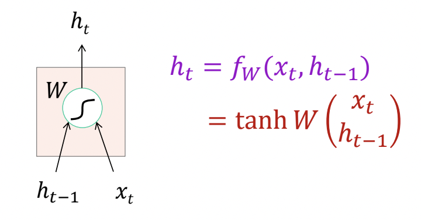
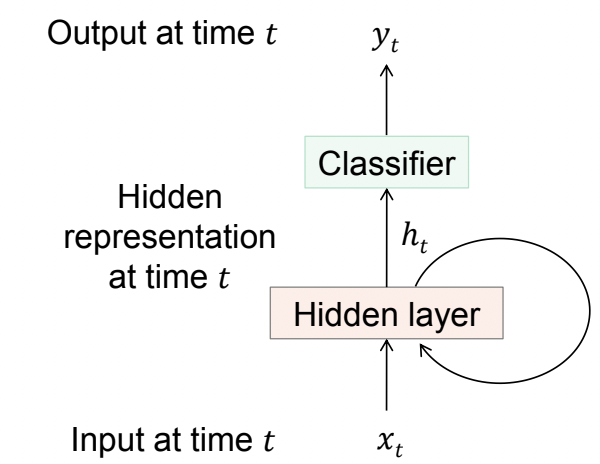
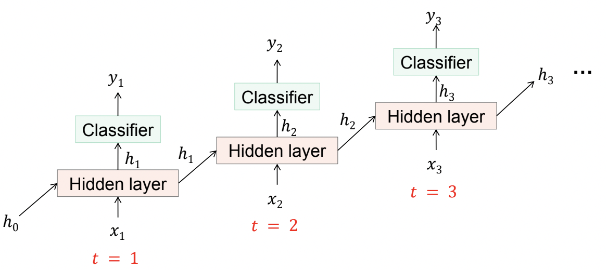

RNN and CNN both came into existence before I was born. It is quite surprising for me to know that Both the dnn came into existence in 1980s. But only in recent years, their true potential were recognised. In this blog post, I will give a brief introduction about the RNN and its type. I have focused more on implementation aspects of RNN rather than the theoretical aspects. I presume that If you are reading this blog then you already know its true potential and the game changing use cases in our day to day lives.

Recurrent Neural Network (RNN) is a kind of deep neural network that deals with variable length input data. To be more precise, it forms a directed graph along temporal sequence when nodes are connected together.  It is very useful when you are dealing with a sequential prediction task e.i. text prediction, machine translation, sentiment analysis, caption generation, time series forecasting etc.  The word _recurrent_ in the name itself is a symbol of recurrency of RNN cell along the temporal sequence. Let's see how a vanilla RNN cell looks like.

  
  <figcaption align='center' style='font-style:italic; color:blue;'>Fig1: A basic RNN cell </figcaption>

In the Fig1, $h_t$ is the hidden state of a given timestamp _t_  and ${h}_{t-1}$ is the output of previous timestamp _(t-1)_.  $x_t$ is the input sequence vector at the given timestamp. when the multiple RNN cells join together, they form a recurrent unit. 

  
  <figcaption  align="center" style='font-style:italic; color:blue;'>Fig2: A Folded Recurrent Unit </figcaption>

Fig2 represents a folded recurrent unit. When it is unfolded, it forms a temporal sequence as shown below (Fig3).

  
  <figcaption  align="center" style='font-style:italic; color:blue;'>Fig3: An Unfolded Recurrent Unit </figcaption>

In Fig3, we can see that along the temporal sequence, output of previous layer is the input of current layer. This forms a recurrent  relation among the RNN cells. 
