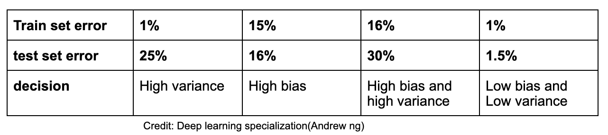

Knowing a machine learning model and it's behaviour is very important for a data scientist. To decide which  model suits best to your needs, model evaluation is very important. In supervised-learning  bias and variance trade-off is a very concerning problem as it is always impossible to achieve the low bias and low variance. Lowering the bias always comes at the risk of increasing model complexity, hence the chance of overfitting increases i.e increase in variance. Likewise, lowering the variance ends up making a model very simple and hence doesn't capture the regularities of training data very well i.e. undefitting(high bias). Thus finding an optimal bias and variance is almost aloof.

In this post, I will briefly talk about how to deal with `bias and variance trade-off`.  Let's see, how bias and variance trade-off actually looks like.

      

**Addressing high variance problem:**

1. Regularization
2. Adding more training data

**Addressing high bias problem:**

1. Reduce regularizing parameters
2. Reduce the model complexity

**Points to remember:**

1. Usually a model having high bias tends to have high variance (worst case scenario). 
2. Deciding a model having either high bias low variance or low bias high variance is completely empirical. 

**Empirical evaluation of a model**

Assuming that human level error is ~0% or more precisely optimal error(bayes error)~ 0%. Note that both human level error and bayes error are two different things. Infact, Bayes error is a more accurate assumption to make as it is the least amount of error that a model can have. It is irreducible. But a human level error could be a more general assumption about how a human deals with such a situation. (_Human-error >= bayes-error_). Nowadays, there are certain deep learning models that have surpassed human in terms of accuracy. 

(_A popular example is ImageNet. Current machine learning systems are better than human error (top-5 error rate of ~4-5%) and rapidly approach Bayes error rate (top-5 error rate of <3%_)

It is always a good approach to asses the model in terms of accuracy/error.

      

In the above table, first column is a case of high varianace problem, second column is a case of high bias problem. Assuming the optimal error as ~0%, third column is a case of high bias and high variance as both the train and test errors are quite high. And the fourth column is what we all expect (_model with low bias and low variance_).

But, if Bayes error is ~ 15%, then the second case (high bias) would be a more appropriate assumption for a model to consider as the relative train and test error is very less.

If you liked this mini blog or any suggestion you want to give, please leave a comment.🙏

---

Happy learning📖📚

